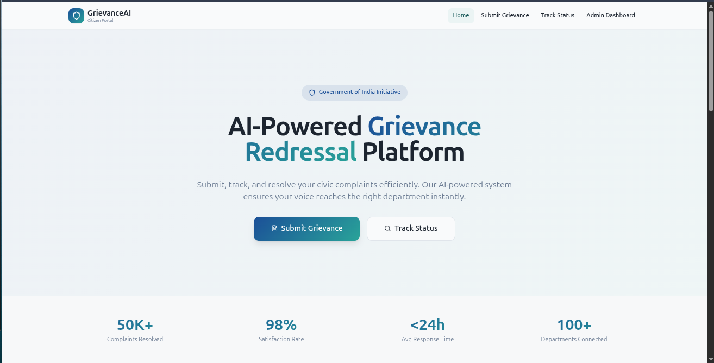
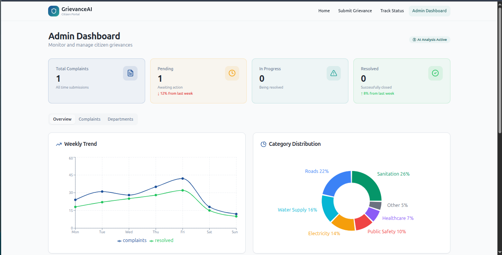
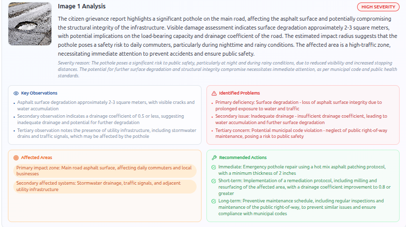
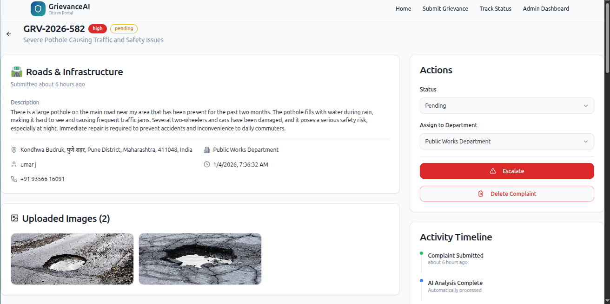

# GrievanceAI - AI-Powered Grievance Redressal Platform

An intelligent citizen grievance management system that leverages AI to analyze complaints, automatically route them to appropriate departments, and provide detailed technical assessments of reported issues.



## Overview

GrievanceAI is a full-stack web application designed to streamline the process of submitting, tracking, and resolving civic complaints. The platform uses advanced AI models to:

- **Analyze sentiment** of grievance descriptions
- **Extract technical details** from uploaded images
- **Auto-assign priority** based on urgency keywords
- **Route complaints** to the correct government department

## Features

### For Citizens
- **Submit Grievances** - File complaints with text descriptions and supporting images
- **Location Picker** - Choose location manually or select from an interactive map with GPS support
- **Track Status** - Monitor complaint progress using a unique ticket ID
- **Real-time Updates** - View current status and department assignment

### For Administrators
- **Dashboard Analytics** - Overview of all complaints with statistics
- **AI-Powered Analysis** - Automatic sentiment detection and image analysis
- **Department Routing** - Complaints auto-assigned based on category
- **Priority Management** - AI-determined urgency levels (low/medium/high)
- **Complaint Management** - Update status, escalate, or delete complaints



## AI Capabilities

### 1. Sentiment Analysis
Uses **HuggingFace multilingual-e5-small** model for sentence similarity-based sentiment detection:
- Compares complaint text with reference sentences for positive, negative, and neutral sentiments
- Returns confidence scores for each sentiment category
- Supports multilingual text (Hindi, English, etc.)

### 2. Image Analysis
Two-stage pipeline using **BLIP** and **Groq LLM**:

**Stage 1: Image Captioning (BLIP)**
- Extracts initial description from uploaded images
- Uses Salesforce BLIP models via HuggingFace Inference API

**Stage 2: Technical Analysis (Groq LLM)**
- Generates professional municipal engineering assessment
- Identifies infrastructure problems and affected areas
- Provides severity ratings with technical justifications
- Suggests immediate, short-term, and long-term remediation actions



### 3. Urgency Scoring
Keyword-based urgency detection (1-10 scale):
- **High (8-9)**: emergency, dangerous, life-threatening, flooding, fire
- **Medium (5-7)**: broken, damaged, leaking, blocked
- **Low (3-4)**: request, suggestion, inquiry, routine

## Technical Architecture

```
┌─────────────────────────────────────────────────────────────────┐
│                        Frontend (React)                         │
│  ┌─────────────┐  ┌──────────────┐  ┌────────────────────────┐  │
│  │ Submit Form │  │ Track Status │  │   Admin Dashboard      │  │
│  │ + Location  │  │              │  │ + Analytics + Search   │  │
│  └─────────────┘  └──────────────┘  └────────────────────────┘  │
└─────────────────────────────────────────────────────────────────┘
                              │
                              ▼
┌─────────────────────────────────────────────────────────────────┐
│                     Backend (FastAPI)                           │
│  ┌─────────────────┐  ┌─────────────────┐  ┌─────────────────┐  │
│  │  REST API       │  │  AI Services    │  │  Database       │  │
│  │  /api/grievances│  │  - Sentiment    │  │  SQLite +       │  │
│  │  /api/analyze-* │  │  - Image        │  │  SQLAlchemy     │  │
│  └─────────────────┘  └─────────────────┘  └─────────────────┘  │
└─────────────────────────────────────────────────────────────────┘
                              │
              ┌───────────────┼───────────────┐
              ▼               ▼               ▼
┌───────────────────┐ ┌─────────────┐ ┌─────────────────┐
│ HuggingFace API   │ │  Groq API   │ │ OpenStreetMap   │
│ - E5 Embeddings   │ │  - LLaMA 3  │ │ - Tiles         │
│ - BLIP Captioning │ │             │ │ - Nominatim     │
└───────────────────┘ └─────────────┘ └─────────────────┘
```

## Tech Stack

### Frontend
| Technology | Purpose |
|------------|---------|
| React 18 | UI Framework |
| TypeScript | Type Safety |
| Vite | Build Tool |
| Tailwind CSS | Styling |
| shadcn/ui | Component Library |
| React Router | Navigation |
| Leaflet | Interactive Maps |
| Recharts | Dashboard Charts |

### Backend
| Technology | Purpose |
|------------|---------|
| FastAPI | REST API Framework |
| SQLAlchemy | ORM |
| SQLite | Database |
| Pydantic | Data Validation |
| python-dotenv | Environment Config |

### AI/ML Services
| Service | Model | Purpose |
|---------|-------|---------|
| HuggingFace | multilingual-e5-small | Sentiment Analysis |
| HuggingFace | BLIP | Image Captioning |
| Groq | LLaMA 3.3 70B | Technical Analysis |

## Project Structure

```
GFGBQ-Team-beyond-the-browser/
├── Frontend/
│   ├── src/
│   │   ├── components/       # Reusable UI components
│   │   │   ├── ui/           # shadcn/ui components
│   │   │   ├── Header.tsx
│   │   │   ├── Footer.tsx
│   │   │   └── LocationPicker.tsx
│   │   ├── pages/
│   │   │   ├── Index.tsx           # Home page
│   │   │   ├── SubmitGrievance.tsx # Submission form
│   │   │   ├── TrackStatus.tsx     # Status tracking
│   │   │   ├── Dashboard.tsx       # Admin dashboard
│   │   │   └── admin/
│   │   │       └── ComplaintDetailPage.tsx
│   │   ├── services/
│   │   │   ├── grievanceService.ts # API client
│   │   │   └── aiService.ts        # AI endpoints
│   │   └── App.tsx
│   ├── package.json
│   └── vite.config.ts
├── backend/
│   ├── app/
│   │   ├── main.py           # FastAPI application
│   │   ├── models.py         # SQLAlchemy models
│   │   ├── database.py       # Database configuration
│   │   └── services/
│   │       └── ai_services.py # AI integration
│   ├── requirements.txt
│   └── .env                  # API keys (not committed)
├── db/
│   └── grievance.db          # SQLite database
└── docs/
    └── screenshots/
```

## Installation

### Prerequisites
- Node.js 18+
- Python 3.10+
- npm or yarn

### Backend Setup

```bash
# Navigate to backend directory
cd backend

# Create virtual environment
python -m venv venv
source venv/bin/activate  # On Windows: venv\Scripts\activate

# Install dependencies
pip install -r requirements.txt

# Create .env file with API keys
cat > .env << EOF
HF_TOKEN=your_huggingface_token
GROQ_API_KEY=your_groq_api_key
EOF

# Start the server
uvicorn app.main:app --reload --host 0.0.0.0 --port 8000
```

### Frontend Setup

```bash
# Navigate to frontend directory
cd Frontend

# Install dependencies
npm install

# Create .env file (optional)
echo "VITE_API_URL=http://localhost:8000" > .env

# Start development server
npm run dev
```

## API Endpoints

### Grievance Management
| Method | Endpoint | Description |
|--------|----------|-------------|
| POST | `/api/grievances` | Create new grievance |
| GET | `/api/grievances` | List all grievances |
| GET | `/api/grievances/{id}` | Get grievance by ID |
| PATCH | `/api/grievances/{id}` | Update grievance |
| DELETE | `/api/grievances/{id}` | Delete grievance |

### AI Analysis
| Method | Endpoint | Description |
|--------|----------|-------------|
| POST | `/api/analyze-text` | Analyze text sentiment |
| POST | `/api/analyze-image` | Analyze image content |
| POST | `/api/analyze-grievance` | Combined analysis |

## Usage

### Submitting a Grievance

1. Navigate to **Submit Grievance** page
2. Fill in personal details (name, phone, email)
3. Enter grievance title and detailed description
4. Select category (Roads, Sanitation, Water Supply, etc.)
5. Add location using manual entry or interactive map
6. Upload supporting images (optional)
7. Submit and receive a unique **Ticket ID**

### Tracking Status

1. Go to **Track Status** page
2. Enter your Ticket ID (e.g., GRV-2026-582)
3. View current status, department assignment, and AI analysis

### Admin Operations

1. Access **Admin Dashboard**
2. View statistics and category distribution
3. Search complaints by ID or keyword
4. Click on a complaint to view details
5. Update status, escalate, or delete as needed



## Environment Variables

### Backend (.env)
```
HF_TOKEN=hf_xxxxxxxxxxxxxxxxxxxxx       # HuggingFace API token
GROQ_API_KEY=gsk_xxxxxxxxxxxxxxxxxxxxx  # Groq API key
```

### Frontend (.env)
```
VITE_API_URL=http://localhost:8000      # Backend API URL
```

## Department Routing

Complaints are automatically routed based on category:

| Category | Department |
|----------|------------|
| Sanitation | Municipal Corporation |
| Water Supply | Water Department |
| Electricity | Electricity Board |
| Roads | Public Works Department |
| Public Safety | Police Department |
| Healthcare | Health Department |
| Education | Education Department |
| Housing | Housing Authority |
| Other | General Administration |

## Contributing

1. Fork the repository
2. Create a feature branch (`git checkout -b feature/amazing-feature`)
3. Commit changes (`git commit -m 'Add amazing feature'`)
4. Push to branch (`git push origin feature/amazing-feature`)
5. Open a Pull Request

## License

This project was developed as part of the **GFG ByteQuest - Vibe Coding Hackathon**.

## Team

**Team Beyond The Browser**

---

Built with AI-powered intelligence for smarter civic governance.
